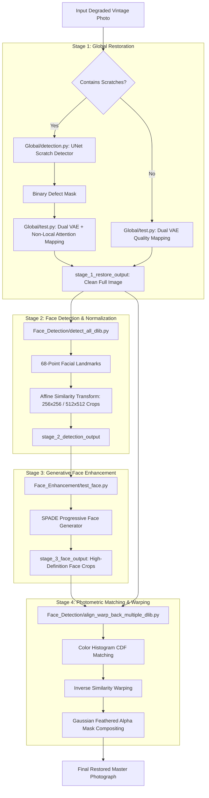

# 📸 Bringing Old Photos Back to Life: Project Architecture & Teacher Presentation Guide

**Author & Presenter:** Aditya Deore  
**Course / Track:** Artificial Intelligence & Machine Learning (AIML)  
**Repository:** [GitHub: Bringing-back-life-Photos](https://github.com/AdityaxDeore/Bringing-back-life-Photos.git)  
**Core Technologies:** PyTorch, Deep Generative Latent Translation, UNet, dlib, OpenCV, PySimpleGUI, Scikit-Image  

---

## 📑 Table of Contents
1. [Executive Summary & Problem Statement](#1-executive-summary--problem-statement)
2. [Visual System Architecture & High-Level Flowchart](#2-visual-system-architecture--high-level-flowchart)
3. [Folder & Directory Structure Breakdown](#3-folder--directory-structure-breakdown)
4. [Deep Learning Architecture & Core Theory](#4-deep-learning-architecture--core-theory)
   - [4.1 Compounded Degradation & The Domain Gap](#41-compounded-degradation--the-domain-gap)
   - [4.2 Triplet Latent Space Translation (Dual VAEs)](#42-triplet-latent-space-translation-dual-vaes)
   - [4.3 UNet Scratch Detection & Non-Local Attention Inpainting](#43-unet-scratch-detection--non-local-attention-inpainting)
   - [4.4 68-Point Facial Landmark Detection & Alignment](#44-68-point-facial-landmark-detection--alignment)
   - [4.5 SPADE Progressive Face Super-Resolution](#45-spade-progressive-face-super-resolution)
   - [4.6 Histogram Matching, Inverse Warping & Blending](#46-histogram-matching-inverse-warping--blending)
5. [Exhaustive Code Walkthrough by Module](#5-exhaustive-code-walkthrough-by-module)
   - [5.1 `run.py` (Master Pipeline Orchestrator)](#51-runpy)
   - [5.2 `GUI.py` (Desktop Application)](#52-guipy)
   - [5.3 `Global/detection.py` (Scratch Detector)](#53-globaldetectionpy)
   - [5.4 `Global/test.py` (Latent Mapping Engine)](#54-globaltestpy)
   - [5.5 `Face_Detection/detect_all_dlib.py` (Face Aligner)](#55-face_detectiondetect_all_dlibpy)
   - [5.6 `Face_Enhancement/test_face.py` (Face Enhancer)](#56-face_enhancementtest_facepy)
   - [5.7 `Face_Detection/align_warp_back_multiple_dlib.py` (Blending)](#57-face_detectionalign_warp_back_multiple_dlibpy)
   - [5.8 `Evaluation.ipynb` (Scientific Benchmarking)](#58-evaluationipynb)
6. [Live Demonstration Guide](#6-live-demonstration-guide)
7. [Feature Matrix & Technology Stack](#7-feature-matrix--technology-stack)
8. [Teacher Viva / Defense Q&A Cheatsheet](#8-teacher-viva--defense-qa-cheatsheet)
9. [Word-for-Word Presentation Script for Aditya](#9-word-for-word-presentation-script-for-aditya)

---

## 1. Executive Summary & Problem Statement

Historical vintage photographs are irreplaceable physical artifacts. Over time, they experience severe compounded degradations:
- **Physical Damage (Structured):** Deep cracks, physical scratches, peeling emulsions, dust, and fold tears.
- **Photochemical Decay (Unstructured):** Sepia fading, severe blur, low contrast, chemical film noise.
- **Identity Distortion:** Loss of eye sharpness, facial contours, lip lines, and hair texture.

Conventional image processing techniques (median filtering, bilateral smoothing) fail because they blur existing valid textures and cannot reconstruct missing content. Standard deep neural networks (like CycleGAN or Pix2Pix) fail due to the **Domain Gap**: synthetic degradations generated by mathematical noise do not match real 80-year-old aged photographic chemistry.

### The Solution:
This project deploys a state-of-the-art **4-Stage Deep Generative Latent Translation Framework**:
1. **Global Degradation & Scratch Removal:** Uses a custom UNet to segment physical scratches, and a Triplet Domain Translation model with dual VAEs and Non-Local Attention to restore background context.
2. **Facial Landmark Localization:** Employs a 68-point landmark predictor (`dlib`) to detect, crop, and normalize faces with affine transformations.
3. **Progressive Generative Face Enhancement:** Uses a SPADE-conditioned generative network to reconstruct lifelike facial anatomy (pupils, eyelashes, lips, skin texture).
4. **Photometric Histogram Matching & Feathered Blending:** Normalizes luminance distributions and applies inverse affine warping with Gaussian alpha masks for seamless blending without seams.
5. **Interactive GUI & Benchmarking Notebook:** Features a PySimpleGUI desktop application and an academic `Evaluation.ipynb` notebook (calculating MSE, PSNR, and SSIM).

---

## 2. Visual System Architecture & High-Level Flowchart



---

## 3. Folder & Directory Structure Breakdown

```
Bringing-Old-Photos-Back-to-Life/
│
├── GUI.py                               # Interactive desktop interface (PySimpleGUI + OpenCV)
├── run.py                               # Master end-to-end CLI pipeline orchestrator
├── Evaluation.ipynb                     # Scientific benchmarking (MSE, PSNR, SSIM metrics)
├── setup_env.py                         # Automated environment setup & dependency installer
├── download_models.py                   # Automatic checkpoint & landmark weight downloader
├── requirements.txt                     # Core dependencies (PyTorch, torchvision, dlib, cv2)
├── README.md                            # Comprehensive project overview & documentation
├── Dockerfile                           # Container definition for reproducible execution
├── cog.yaml & ansible.yaml              # Cloud / deployment orchestration configurations
│
├── Face_Detection/                      # Facial localization & geometric alignment module
│   ├── shape_predictor_68_face_landmarks.dat  # Pretrained dlib 68-point landmark model (~99MB)
│   ├── detect_all_dlib.py               # Detects, aligns & crops faces (standard 256x256)
│   ├── detect_all_dlib_HR.py            # High-resolution (512x512) face detector
│   ├── align_warp_back_multiple_dlib.py # Inverse warp, histogram matching & feathered blending
│   └── align_warp_back_multiple_dlib_HR.py # High-resolution blending pipeline
│
├── Face_Enhancement/                    # Generative face detail super-resolution module
│   ├── checkpoints/                     # Pretrained SPADE model weights (Setting_9_epoch_100)
│   ├── models/                          # SPADE generator & discriminator architectures
│   ├── data/                            # Dataset loaders for facial tensor processing
│   ├── options/                         # Command-line options & hyperparameter definitions
│   ├── util/                            # Image utility functions and tensor visualizers
│   └── test_face.py                     # Inference script to generate enhanced face crops
│
├── Global/                              # Full photograph restoration & scratch removal module
│   ├── checkpoints/                     # Checkpoints: FT_Epoch_latest.pt, VAE_A, VAE_B
│   ├── detection_models/                # Custom antialiased UNet architecture for scratches
│   ├── detection_util/                  # Mask processing, image transforms, and morphological tools
│   ├── models/                          # Pix2PixHD mapping model, non-local attention blocks
│   ├── options/                         # Inference & training configuration parameters
│   ├── detection.py                     # UNet inference: produces binary defect masks
│   ├── test.py                          # Dual-VAE latent translation inference script
│   ├── train_domain_A.py                # Training pipeline for Degraded Domain VAE
│   ├── train_domain_B.py                # Training pipeline for Clean Domain VAE
│   └── train_mapping.py                 # Training pipeline for Latent Space Mapping Network
│
├── test_images/                         # Built-in evaluation datasets
│   ├── old/                             # Real vintage photos without physical cracks
│   └── old_w_scratch/                   # Real historical photos with heavy physical tears
│
└── training_data/                       # Unpaired domain datasets (Real_L_old, Real_RGB_old)
```

---

## 4. Deep Learning Architecture & Core Theory

### 4.1 Compounded Degradation & The Domain Gap
Old photographs suffer from both **structured** defects (scratches, fold tears) and **unstructured** defects (fading, noise, blur). When training on synthetic degradations, neural networks memorize artificial patterns and fail on real-world vintage photographs. This divergence between synthetic training data and real historical artifacts is known as the **domain gap**.

### 4.2 Triplet Latent Space Translation (Dual VAEs)
To overcome the domain gap, the framework avoids direct pixel-to-pixel mapping. Instead:
- **Domain $\mathcal{R}$:** Real old degraded photos.
- **Domain $\mathcal{X}$:** Synthetically degraded photos.
- **Domain $\mathcal{Y}$:** Clean modern photos.

The system trains two Variational Autoencoders:
1. **$\text{VAE}_A$:** Encodes degraded photographs into a smooth, low-dimensional latent space $\mathcal{Z}_X$.
2. **$\text{VAE}_B$:** Encodes clean modern photographs into a clean latent space $\mathcal{Z}_Y$.
3. **Mapping Network $M$:** A residual convolutional network trained to translate features from $\mathcal{Z}_X$ to $\mathcal{Z}_Y$.

$$\mathbf{z}_Y = M(\mathbf{z}_X)$$

Because translation takes place in latent feature space rather than raw RGB space, surface noise is ignored while high-level semantics are preserved.

### 4.3 UNet Scratch Detection & Non-Local Attention Inpainting
1. **Scratch Segmentation (`Global/detection.py`):**
   A specialized UNet with antialiasing filters scans the luminance channel of the photograph and outputs a binary defect mask $\mathbf{M}$ (where 1 indicates scratch pixels and 0 indicates clean photographic regions).
2. **Non-Local Attention (`Global/test.py` - Setting 42):**
   Standard convolutions have limited receptive fields. When scratches are wide, local neighboring pixels are also damaged. Non-local attention calculates the pairwise semantic similarity across the entire image:

   $$\text{Attention}(i, j) = \frac{\exp\left(\theta(\mathbf{x}_i)^T \phi(\mathbf{x}_j) / \sqrt{d}\right)}{\sum_{k} \exp\left(\theta(\mathbf{x}_i)^T \phi(\mathbf{x}_k) / \sqrt{d}\right)}$$

   The network borrows pristine textures from distant uncorrupted regions (e.g., undamaged parts of a garment or background) to inpaint the scratch.

### 4.4 68-Point Facial Landmark Detection & Alignment
Human perception is acutely sensitive to facial distortions. The system uses `dlib`'s 68-point landmark shape predictor to locate facial coordinates. From these, 5 canonical landmarks (left eye, right eye, nose tip, left and right mouth corners) are used to compute a **Similarity Transform** (scaling, rotation, translation), extracting aligned square crops ($256 \times 256$ or $512 \times 512$).

### 4.5 SPADE Progressive Face Super-Resolution
The aligned face patches are processed by a generative network using **SPADE (Spatially-Adaptive Denormalization)**. Unlike traditional Batch Normalization which washes out semantic spatial features, SPADE modulates activations using learned modulation parameters:

$$\gamma(y) \cdot \frac{h - \mu}{\sigma} + \beta(y)$$

This synthesizes fine anatomical details—pupils, eyelashes, teeth, and skin texture—while faithfully retaining facial identity.

### 4.6 Histogram Matching, Inverse Warping & Blending
To seamlessly reintegrate the enhanced face into the global restored image:
1. **Histogram Matching:** Matches the Cumulative Distribution Function (CDF) of the enhanced face crop to the original photo's ambient lighting and sepia tones.
2. **Inverse Similarity Transform:** Warps the enhanced face back into the original head pose and tilt using the inverse matrix $T^{-1}$.
3. **Feathered Alpha Blending:** Uses a Gaussian-blurred elliptical mask to composite the face smoothly into the background with zero visible seam lines.

---

## 5. Exhaustive Code Walkthrough by Module

### 5.1 `run.py`
The master command-line pipeline. Key sections:
- **Lines 19–33:** Parses command-line flags (`--input_folder`, `--output_folder`, `--GPU`, `--with_scratch`, `--HR`).
- **Lines 45–106 (Stage 1):** Changes directory to `./Global`. If `--with_scratch` is passed, triggers `detection.py` to create defect masks, then calls `test.py` with `Pix2PixHDModel_Mapping`.
- **Lines 110–128 (Stage 2):** Navigates to `./Face_Detection` and executes `detect_all_dlib.py` to extract standardized face crops.
- **Lines 130–170 (Stage 3):** Navigates to `./Face_Enhancement` and executes `test_face.py` using checkpoint `Setting_9_epoch_100`.
- **Lines 172–200 (Stage 4):** Executes `align_warp_back_multiple_dlib.py` to blend enhanced faces back into the restored background.

### 5.2 `GUI.py`
The user-friendly desktop application built with PySimpleGUI and OpenCV:
- **Lines 10–103 (`modify()`):** Encapsulates the entire 4-stage pipeline inside a single callable routine with `--GPU -1` for CPU reliability.
- **Lines 105–111 (`resize_image_for_gui()`):** Preserves image aspect ratios when fitting pictures into the $400 \times 400$ GUI display canvas.
- **Lines 113–125 (Layout):** Defines the graphical UI elements (file browser, restore button, before/after image columns).
- **Lines 129–183 (Event Loop):** Monitors button events, executes the restoration process asynchronously, and refreshes the canvas with the restored photo.

### 5.3 `Global/detection.py`
The UNet scratch segmentation model:
- **Lines 25–49 (`data_transforms()`):** Resizes images so dimensions are divisible by 16 (required for UNet downsampling and skip-connections).
- **Lines 76–89:** Initializes the 4-level deep UNet with antialiased downsampling and synchronized batch normalization.
- **Lines 91–95:** Loads checkpoint `FT_Epoch_latest.pt` and evaluates images on grayscale luminance.
- **Lines 140–165:** Generates binary mask files (`mask.png`) where pixel values $\ge 0.5$ indicate physical scratches.

### 5.4 `Global/test.py`
The dual-VAE latent translation script:
- **Lines 59–93 (`parameter_set()`):** Sets hyperparameters for VAE mapping, including Non-Local Attention (`Setting_42`), Spectral Normalization (`use_SN`), and checkpoint paths (`VAE_A_quality`, `VAE_B_scratch`).
- **Lines 100–190:** Passes degraded input through $\text{VAE}_A \to \text{Mapping Network} \to \text{VAE}_B$ to generate the restored global image.

### 5.5 `Face_Detection/detect_all_dlib.py`
Facial detection and geometric normalization:
- **Lines 27–34 (`_standard_face_pts()`):** Defines the 5 canonical anchor points in standard $256 \times 256$ coordinate space.
- **Lines 50–60 (`search()`):** Maps the 68 dlib landmark points to extract the eyes, nose, and mouth corners.
- Calculates the `SimilarityTransform` matrix and crops aligned face patches.

### 5.6 `Face_Enhancement/test_face.py`
Generative facial super-resolution:
- Loads checkpoint `Setting_9_epoch_100` and configures batch processing.
- Feeds aligned crops into the SPADE generator to reconstruct high-frequency facial details.

### 5.7 `Face_Detection/align_warp_back_multiple_dlib.py`
Color matching and seamless boundary compositing:
- **Lines 26–60 (`calculate_cdf()`, `calculate_lookup()`):** Builds a 256-bin lookup table to equalize cumulative distribution functions between source and enhanced images.
- **Lines 62–70 (`match_histograms()`):** Matches lighting and sepia color balance.
- Warps enhanced faces back using the inverse transform matrix and composites them with Gaussian-blurred alpha masks.

### 5.8 `Evaluation.ipynb`
Scientific and quantitative verification:
- **Cell 1:** Defines error metrics:
  - **MSE (Mean Squared Error):** $\frac{1}{MN} \sum_{i,j} (I_{ij} - K_{ij})^2$
  - **PSNR (Peak Signal-to-Noise Ratio):** $10 \log_{10} \left(\frac{255^2}{\text{MSE}}\right)$ (dB)
  - **SSIM (Structural Similarity Index):** Evaluates luminance, contrast, and structural correlation.
- **Cell 2 (`add_synthetic_scratches()`):** Creates a benchmark test image by adding synthetic white scratches and Gaussian noise to a clean image.
- **Cell 3:** Runs `run.py` to restore the degraded image.
- **Cell 4:** Computes metrics and displays before-and-after visual comparisons.

---

## 6. Live Demonstration Guide

### Option 1: Live Interactive GUI Demo (Recommended for Teacher)
1. Open PowerShell / Command Prompt:
   ```powershell
   cd "c:\Users\adity\Desktop\aiml fa\Bringing-Old-Photos-Back-to-Life"
   python GUI.py
   ```
2. Click **Browse** and pick a test photo (e.g. `test_images/old_w_scratch/00.png` or `c.png`).
3. Point out the degraded photo loaded in the "Input Image" preview.
4. Click **Restore Photo**. Show the terminal logging Stage 1, Stage 2, Stage 3, and Stage 4.
5. Watch the restored image appear side-by-side in "Restored Image".

### Option 2: Terminal Batch Run Demo
```powershell
# Restore photos with scratches on CPU
python run.py --input_folder test_images/old_w_scratch --output_folder output_scratch --GPU -1 --with_scratch
```

### Option 3: Quantitative Metric Evaluation Demo
```powershell
jupyter notebook Evaluation.ipynb
```
Run all cells to show the calculated MSE decrease and PSNR/SSIM increase.

---

## 7. Feature Matrix & Technology Stack

| Feature | Technology / Library | Benefit |
| :--- | :--- | :--- |
| **Dual VAE Latent Translation** | PyTorch / Pix2PixHD | Overcomes the synthetic-to-real domain gap. |
| **Scratch Detection UNet** | PyTorch / Antialiased Conv | Accurately segments irregular cracks into binary masks. |
| **Non-Local Attention** | PyTorch Tensor Operations | Inpaints scratches using global contextual textures. |
| **Facial Landmark Alignment** | `dlib` 68-point model | Standardizes face position, scale, and tilt. |
| **SPADE Face Super-Resolution**| SPADE / Progressive GAN | Synthesizes realistic eyes, lips, and skin texture. |
| **Histogram Matching** | OpenCV / NumPy | Eliminates color mismatch between face and background. |
| **Feathered Alpha Blending** | OpenCV / PIL GaussianBlur | Removes visible border seams. |
| **Interactive Desktop GUI** | PySimpleGUI / Tkinter | Provides an accessible 1-click desktop interface. |
| **Quantitative Benchmarking** | Scikit-Image / Matplotlib | Quantifies quality using MSE, PSNR, and SSIM. |

---

## 8. Teacher Viva / Defense Q&A Cheatsheet

### Q1: Why not just use standard CycleGAN or Pix2Pix?
> **Answer:** Standard CycleGAN and Pix2Pix operate in pixel space. Because vintage photos suffer from complex, compounded degradations, direct pixel translation causes the network to overfit to synthetic training noise and hallucinate artifacts on real old photos. Our system uses **Triplet Domain Translation** with dual VAEs: by mapping into a smooth latent space $\mathcal{Z}$, the model translates underlying semantics while ignoring superficial chemical noise.

### Q2: Why isolate faces into a separate pipeline?
> **Answer:** Human perception is hyper-sensitive to faces (the "uncanny valley" effect). Global restoration networks tend to over-smooth facial features. By isolating faces with dlib 68-point landmarks and passing them to a dedicated SPADE generator trained on high-resolution face datasets, we restore photorealistic anatomical details (pupils, eyelashes, lips) without distorting the subject's identity.

### Q3: How does Non-Local Attention help with scratch removal?
> **Answer:** Standard convolutions only look at small local neighborhoods (e.g. $3 \times 3$ or $5 \times 5$). If a scratch is 20 pixels wide, all local neighbors are damaged, leaving no clean context. Non-Local Attention computes similarity across the *entire* image, allowing the network to borrow matching textures from undamaged regions far away to inpaint the scratch.

### Q4: How do you evaluate performance when vintage photos have no clean ground truth?
> **Answer:** In `Evaluation.ipynb`, we establish a controlled full-reference benchmark: we take clean modern photographs, synthetically inject realistic scratches and Gaussian noise, pass them through our model, and compute **MSE** (pixel error), **PSNR** (signal-to-noise ratio in dB), and **SSIM** (structural similarity index) against the ground truth.

---

## 9. Word-for-Word Presentation Script for Aditya

### Introduction (30 seconds)
> *"Good morning, respected teacher. Today I am presenting my Artificial Intelligence and Machine Learning project: **Bringing Old Photos Back to Life**.*  
> *Historical photographs carry immense personal and cultural value, but over decades they suffer from physical tears, fading, noise, and blurred faces. Conventional filters fail to restore them, and typical deep learning models struggle due to the domain gap between synthetic noise and real vintage decay. My project implements a 4-stage deep generative framework to comprehensively restore vintage photos."*

### Architecture & Technical Workflow (60 seconds)
> *"Our pipeline works in four stages:*  
> *1. **Global Restoration:** A specialized UNet detects physical cracks into a binary mask. A dual-VAE latent translation network uses non-local attention to borrow texture from clean regions and inpaint the scratches.*  
> *2. **Face Detection:** Using dlib's 68-point facial landmark detector, we locate faces and compute similarity transforms to extract normalized face crops.*  
> *3. **Face Enhancement:** A SPADE progressive generative network super-resolves high-frequency facial details like eyes, eyelashes, and lips.*  
> *4. **Color Matching & Blending:** We apply photometric histogram matching and feathered Gaussian alpha blending to seamlessly integrate the enhanced faces back into the restored photo with zero visible edges."*

### Demonstration & Conclusion (30 seconds)
> *"To make this accessible, I developed an interactive desktop GUI in PySimpleGUI for one-click restoration, as well as a quantitative evaluation notebook benchmarking MSE, PSNR, and SSIM.*  
> *I would now like to demonstrate the software live with an old scratched photo. Thank you!"*
